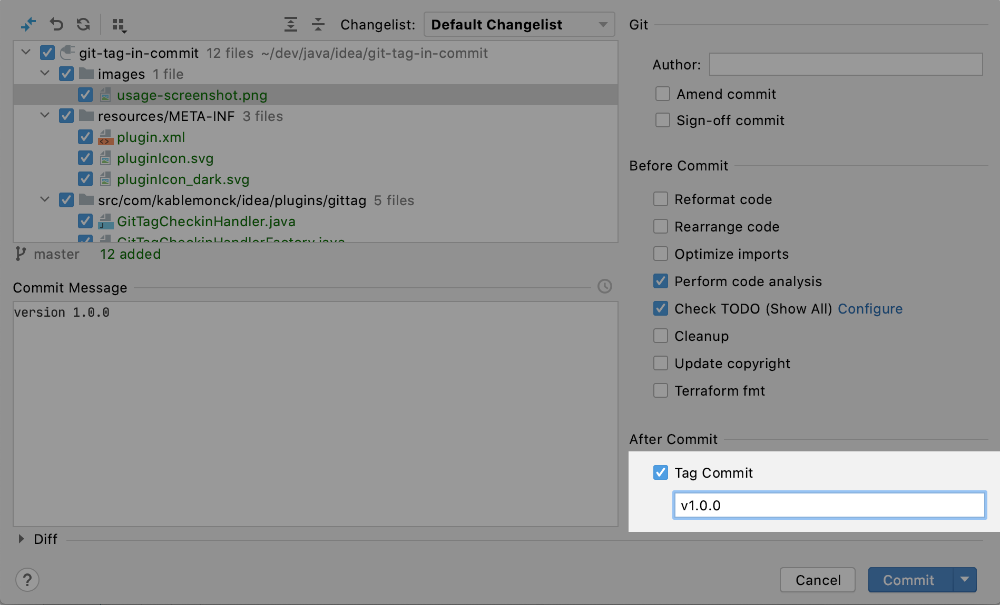

# Git Tag From Commit Dialog
IntelliJ Platform plugin to add a git tag from the commit dialog.

## Changes
### 1.0.0
*17 Sep 2020*
 * Added "Tag Commit" checkbox and text field to commit dialog
 * Ensure tags are pushed when "Commit and Push" is selected
 * Ensure tags can be created if committing across multiple roots
 * Save and restore tag name
 